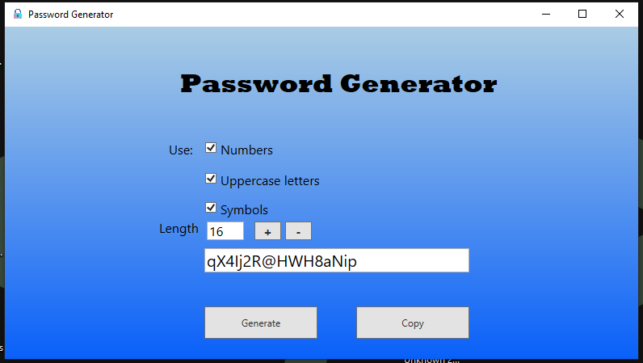
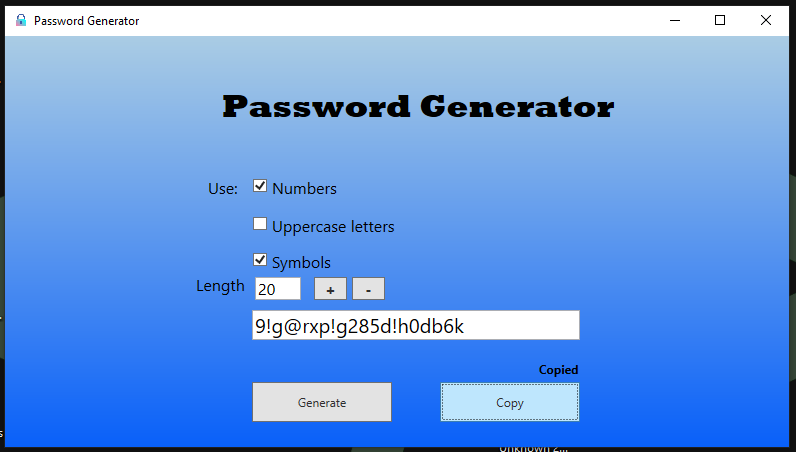

# PasswordGeneratorWPF
Password generator built in WPF

# Features
- C#
- .Net Framework
- WPF
- Using Security Cryptography (RNGCryptoServiceProvider)

# Images

  
  

  

  
  

# Download
SourceForge: https://sourceforge.net/projects/passwordgeneratorwpf/
